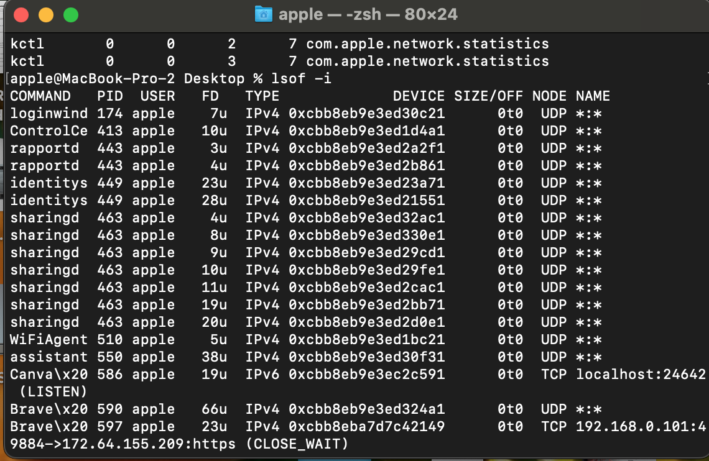

Linux Basics and SOC Foundations

## Objective
Learn basic Linux commands, process monitoring, network investigation, and file permissions used in cybersecurity.

---

# Commands Learned

## pwd
Shows current directory.

## ls / ls -la
Lists files and permissions.

## cd
Changes directory.

## mkdir
Creates folder.

## touch
Creates file.

## cat
Displays file content.

## mv / cp / rm
Move, copy, and delete files.

---
# Network Investigation
lsof -i

Shows active network connections and listening ports.

Observed:

Brave Browser connections
Canva listening service
HTTPS traffic
TCP states like CLOSE_WAIT
# Screenshot

## Network Connections Analysis



---

# File Permissions
ls -l

Example:

-rw-r--r--

Permissions:

r → read
w → write
x → execute

---

# Process Monitoring

## ps aux
Shows running processes.

Example:
```bash
ps aux | grep chrome
