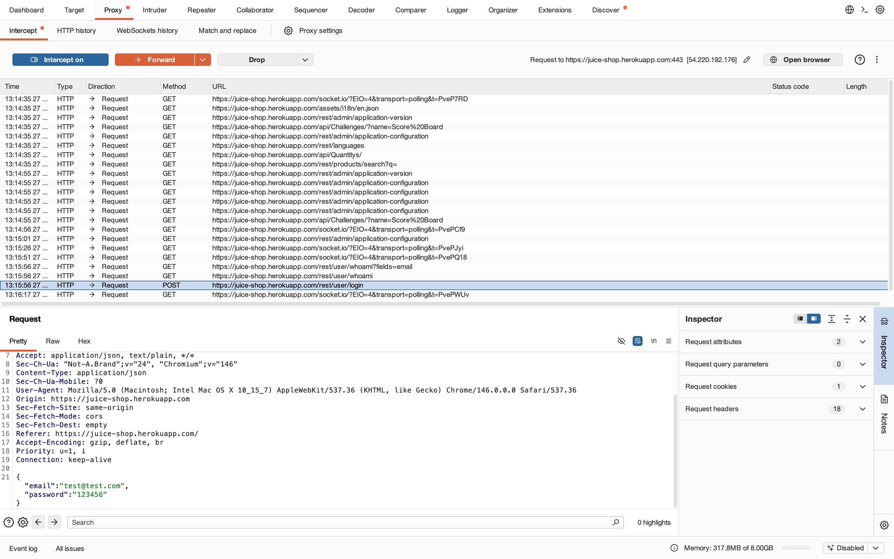

Web Security Basics Using Burp Suite

## Objective
To understand how web applications communicate using HTTP requests and how Burp Suite intercepts traffic.

---

# Burp Suite

Burp Suite is a web application security testing tool used for:
- intercepting requests
- analyzing traffic
- testing APIs
- inspecting authentication systems

---

# GET vs POST

## GET Request
- Used to retrieve data
- Parameters visible in URL
- Less secure for sensitive data

Example:
GET /products

---

## POST Request
- Used to send sensitive data
- Data sent inside request body
- Commonly used for login systems

Observed request:
POST /rest/user/login

---
# Screenshot



---
# JSON Request Body

The login request contained JSON data:

```json
{
  "email":"test@test.com",
  "password":"123456"
}
