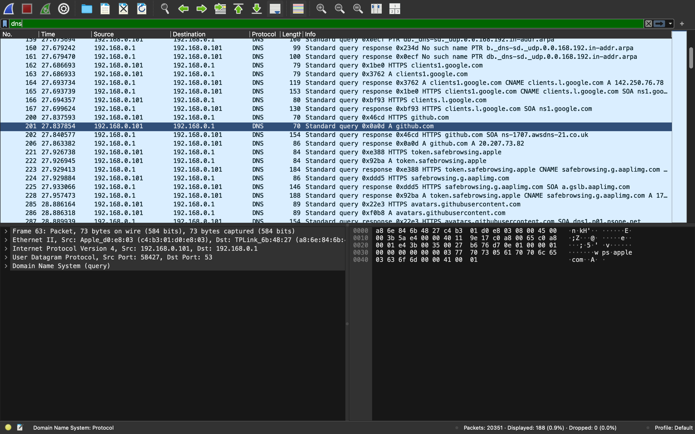
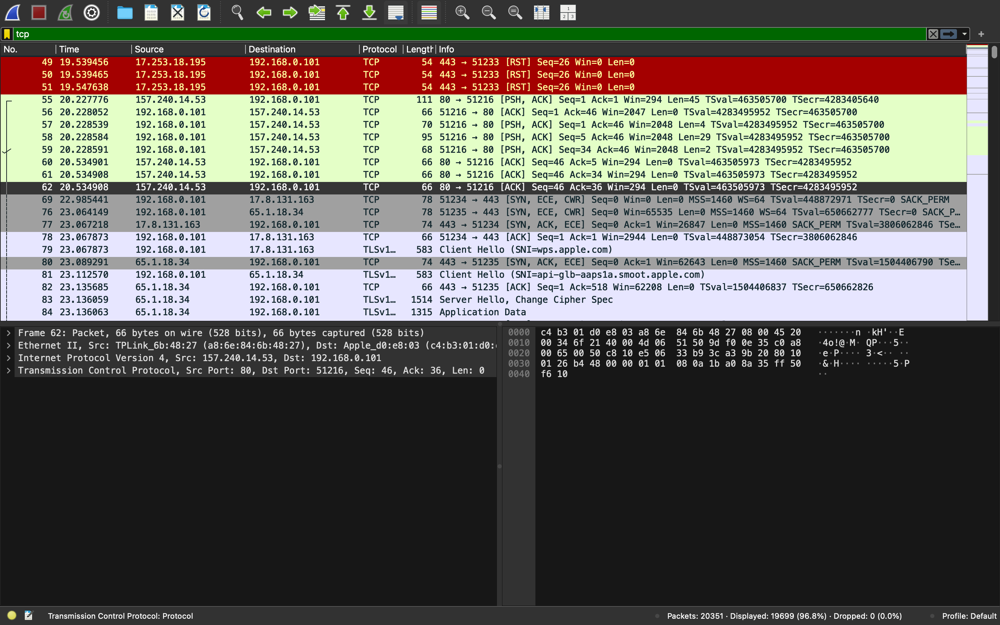

Network Traffic Analysis Using Wireshark

## Objective
To analyze real-time network traffic and understand DNS, TCP, and encrypted HTTPS communication using Wireshark.

---

# What DNS Does

DNS (Domain Name System) translates website names into IP addresses that computers can understand.

Example:

github.com → 20.207.73.82

During packet capture, DNS queries and responses were visible when websites were opened in the browser.

Observed packets included:
- Standard query A github.com
- DNS response packets

DNS traffic was mainly using:
- Port 53

---

# TCP Handshake Steps

TCP establishes a reliable connection using a three-way handshake.

## Steps

1. SYN
Client requests connection.

2. SYN-ACK
Server acknowledges the request.

3. ACK
Client confirms the connection.

After these steps, data transfer begins.

In Wireshark, packets such as:
- [SYN]
- [SYN, ACK]
- [ACK]

were observed during TCP communication.

---

# Difference Between Encrypted and Unencrypted Traffic

## Unencrypted Traffic (HTTP)
- Data is readable
- No encryption protection
- Easier to intercept

Example:
- HTTP traffic

---

## Encrypted Traffic (HTTPS/TLS)
- Data is encrypted
- Secure communication
- Contents are not easily readable

Observed protocols:
- TLSv1.3

HTTPS traffic appeared as encrypted TLS packets in Wireshark.

---

# Observations From Wireshark

- DNS queries were generated while opening websites.
- TCP packets established connections before communication.
- HTTPS traffic used TLS encryption.
- Source and destination IP addresses were visible.
- Multiple protocols including DNS, TCP, and TLS were observed in real time.
- Packet capture showed how systems communicate across networks.

---

# Tools Used

- Wireshark
- macOS Terminal
- Web Browser
 --- 
 # Screenshots

## DNS Traffic Analysis

---

## TCP Traffic Analysis

---

# Key Learning

This exercise helped in understanding:
- Network communication
- DNS resolution
- TCP connection establishment
- Encrypted web traffic
- Real-time packet analysis
  
