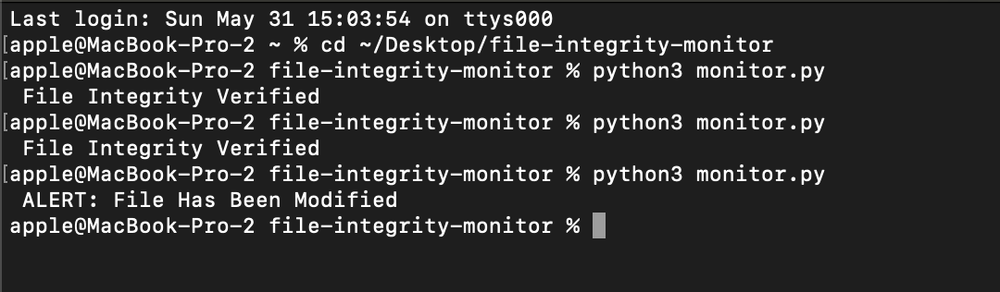
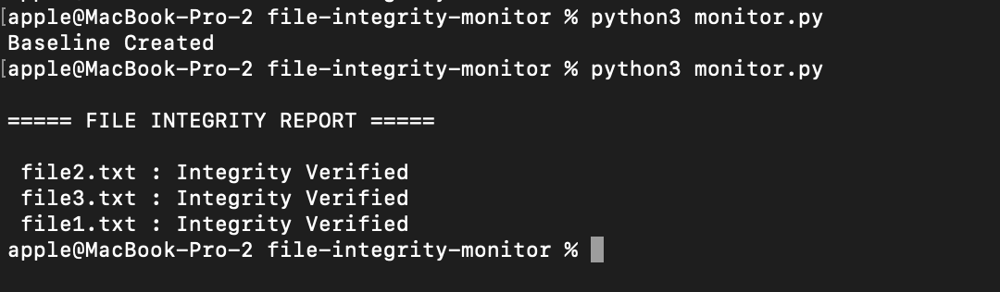
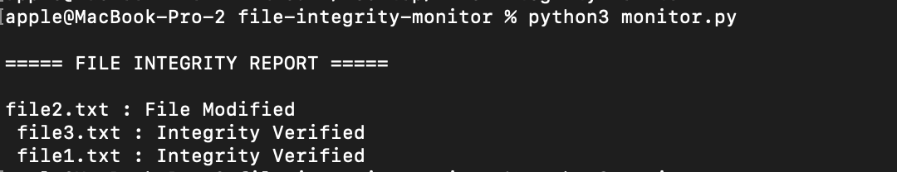
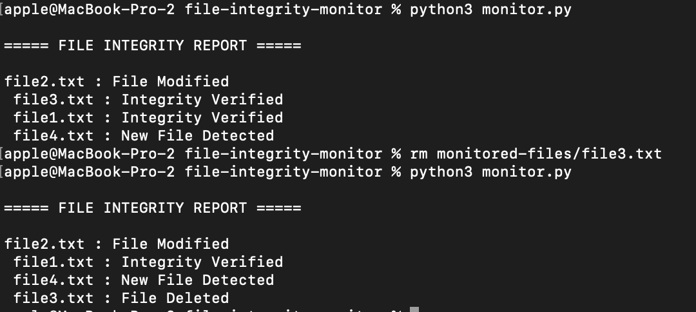
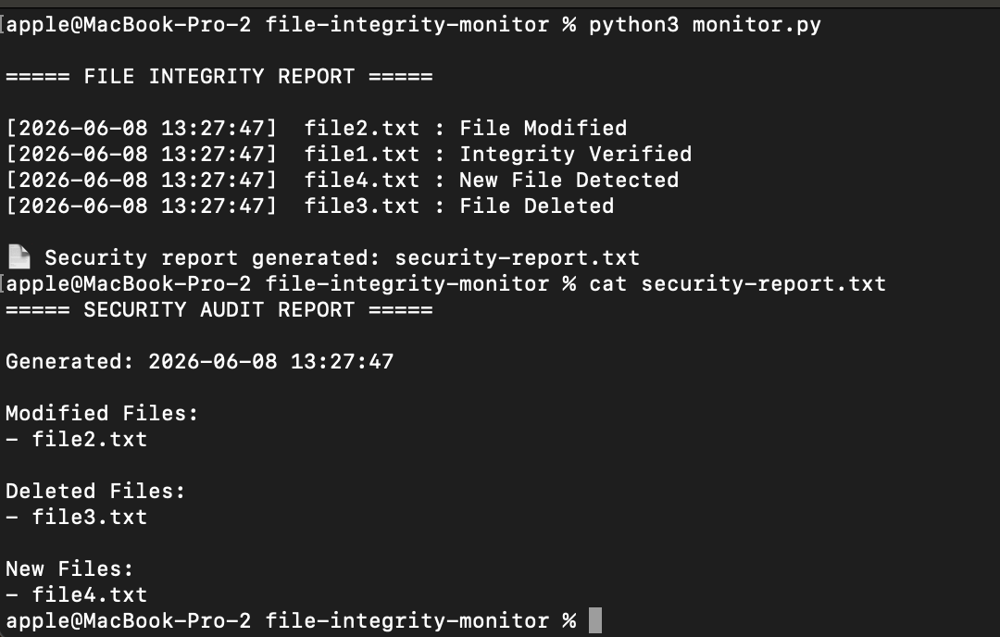
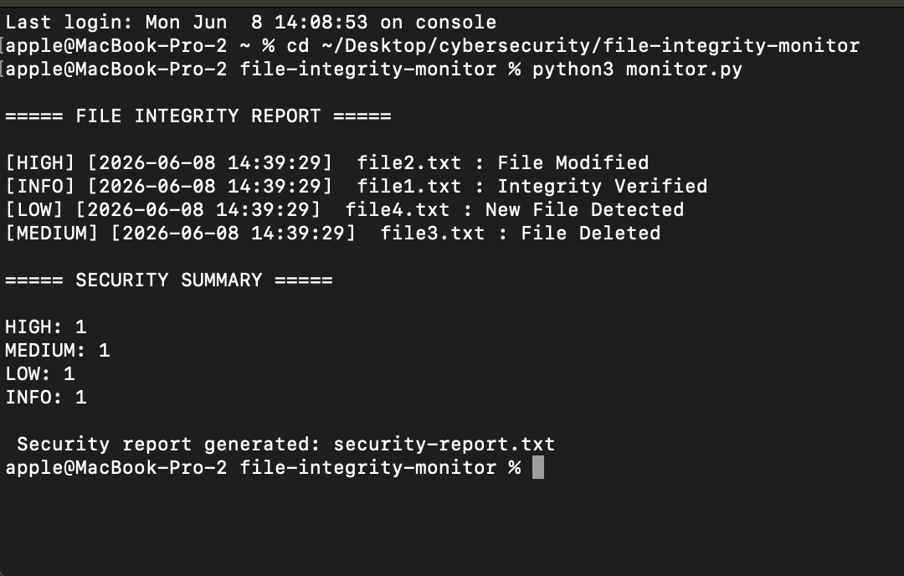

# File Integrity Monitoring System

A cybersecurity tool that detects unauthorized file modifications using SHA-256 hashing.

## Features

- SHA-256 hashing
- Baseline creation
- Integrity verification
- Tamper detection

## Technologies

- Python 3
- hashlib

## Use Cases

- File monitoring
- Tamper detection
- Security auditing
- Incident response

## screenshot

### Integrity Verified and File Modification Alert

---
## Multiple File Monitoring

The system can monitor multiple files simultaneously and detect unauthorized modifications.

### Example Output

### Integrity Verified

### File Modification Alert

## Advanced Monitoring

The system can detect:

- File modifications
- Newly created files
- Deleted files

### Example Output

### Security Audit Reports
The system automatically generates a security audit report after each scan.

### Timestamped Events

All security events are logged with timestamps for auditing purposes.

### Example Output

## Severity Classification

Security events are categorized by priority.

### Example Output

 
## Future Improvements
Severity Classification
Email Alerts
Real-Time Monitoring
Folder Monitoring
GUI Dashboard
Threat Scoring
