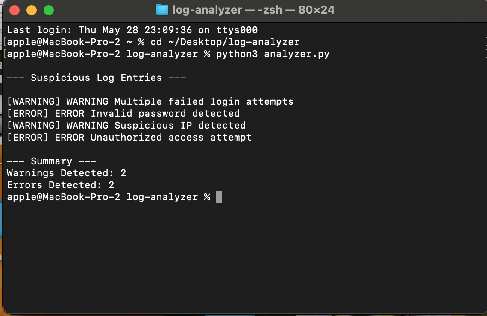

# Python Log Analyzer

A beginner cybersecurity project that analyzes log files and detects suspicious entries.

## Features
- Detects WARNING logs
- Detects ERROR logs
- Counts suspicious events
- Displays security-related activity

## Technologies
- Python 3
- File Handling
- Security Log Analysis

## Example Detection
- Failed login attempts
- Unauthorized access attempts
- Suspicious IP activity

# Screenshot

