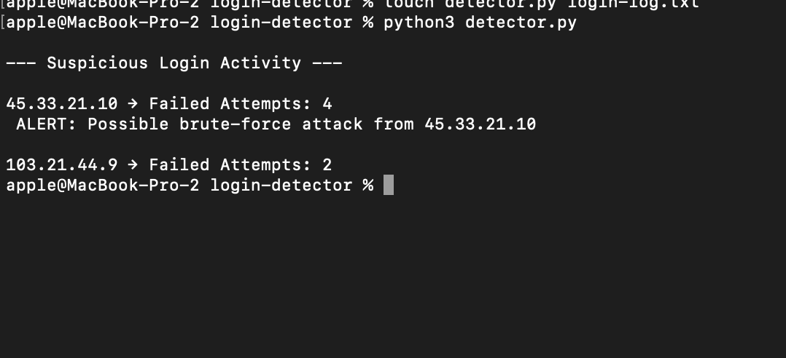

# Suspicious Login Detector

A beginner cybersecurity project that detects repeated failed login attempts and possible brute-force attacks.

## Features
- Detects failed login attempts
- Counts suspicious activity
- Identifies attacker IP addresses
- Generates brute-force alerts

## Technologies
- Python 3
- File Handling
- Security Log Analysis

## Example Detection
- Repeated failed login attempts
- Suspicious IP activity
  
 # Screenshot

