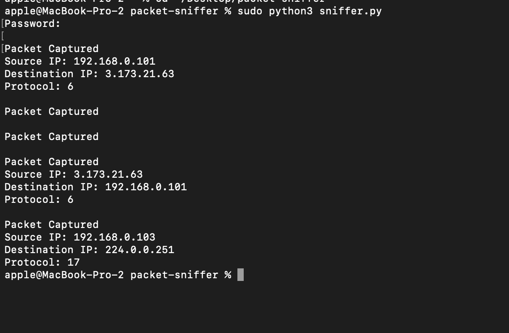

# Python Packet Sniffer

A beginner cybersecurity project that captures and analyzes network packets using Python and Scapy.

## Features
- Captures live packets
- Displays source IP
- Displays destination IP
- Displays protocol information

## Technologies
- Python 3
- Scapy
- Network Packet Analysis

## Example Output
- Source IP
- Destination IP
- Protocol Number
  
## Screenshot

