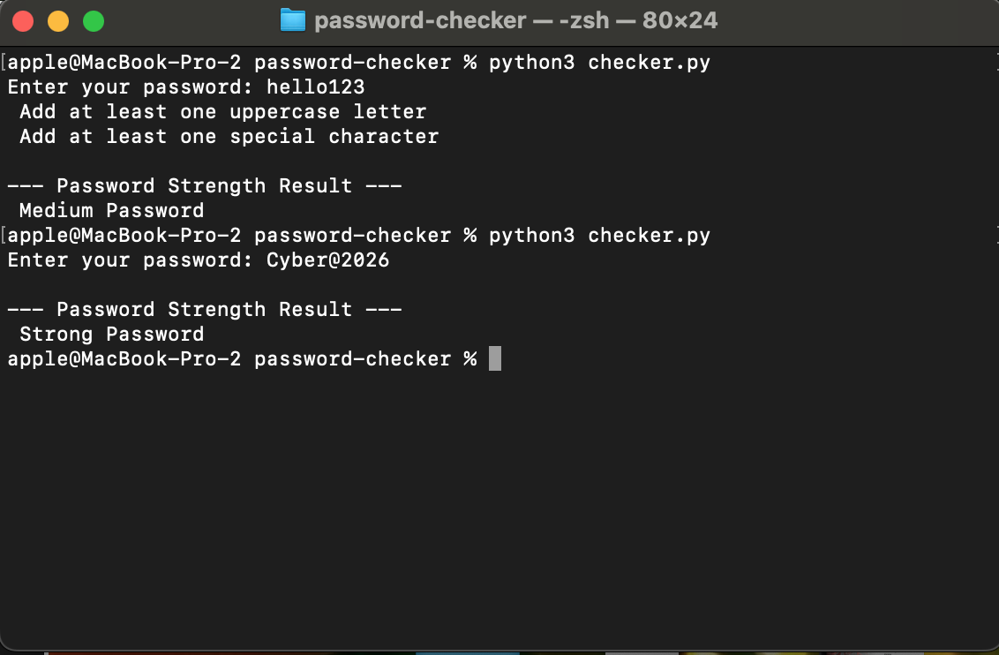

# Password Strength Checker

A beginner cybersecurity project that checks password strength using Python and regex.

## Features
- Checks password length
- Detects uppercase letters
- Detects lowercase letters
- Detects numbers
- Detects special characters

## Technologies
- Python 3
- Regex
- Input Validation

## Example
Strong Password:
Cyber@2026

# Screenshots

## Password Example

---

