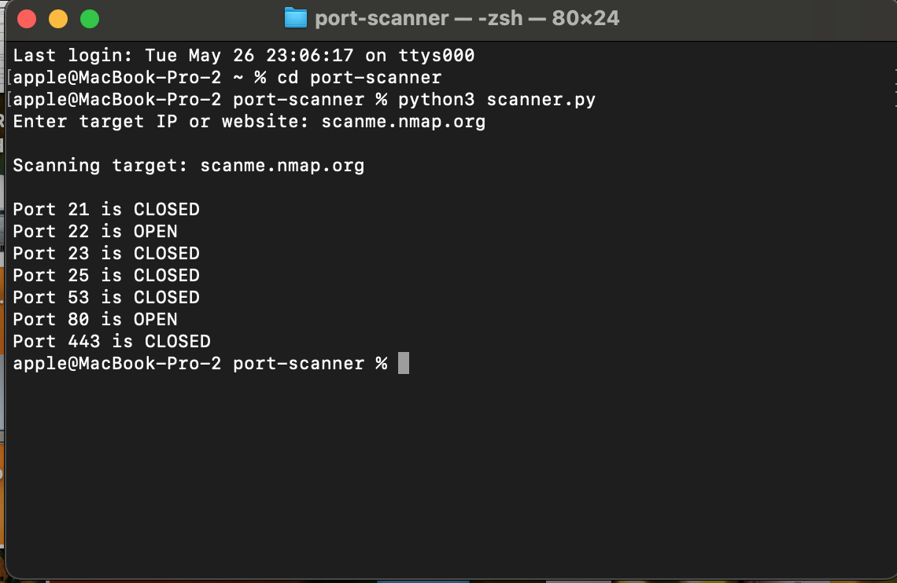

# Python Port Scanner

A beginner cybersecurity project built using Python.

## Features
- Scans common ports
- Detects open/closed ports
- Uses Python socket programming

## Technologies Used
- Python 3
- Socket Module
- Networking Basics

## Example Target
scanme.nmap.org

## Screenshot

