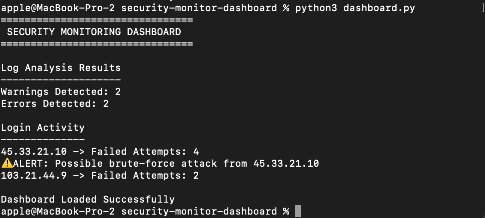
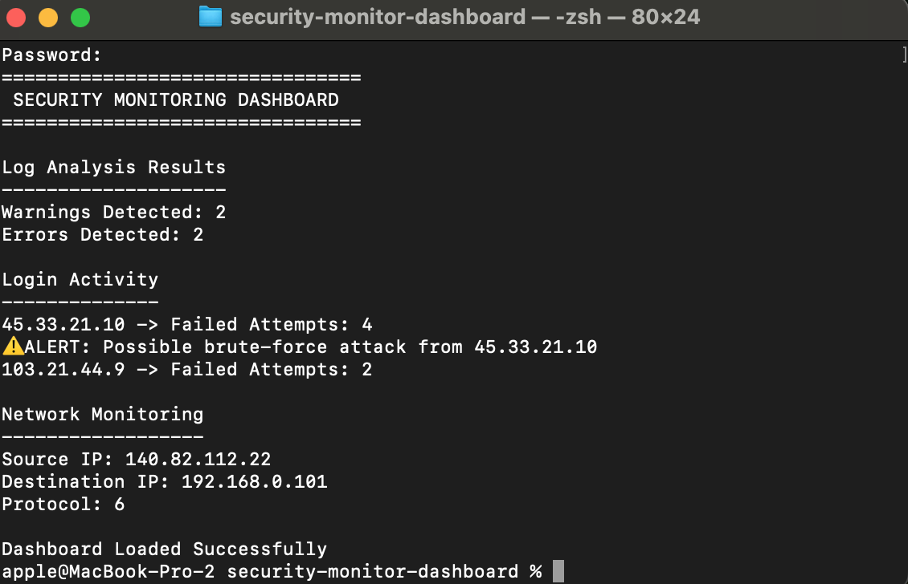
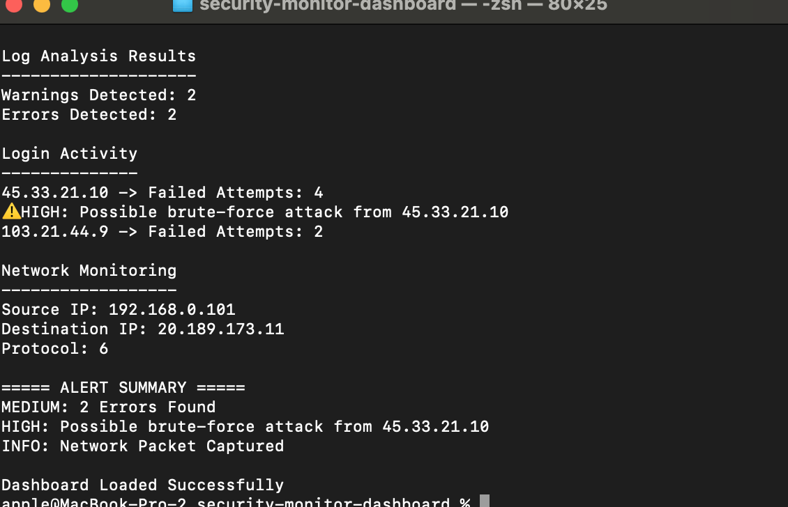

# Security Monitoring Dashboard

A Python-based cybersecurity monitoring dashboard that combines log analysis, suspicious login detection, and network monitoring into a single security monitoring platform.

## Features

### Log Analysis
- Detects warnings and errors
- Monitors suspicious log activity
- Generates security event counts

### Login Monitoring
- Detects failed login attempts
- Identifies suspicious IP addresses
- Detects possible brute-force attacks

### Network Monitoring
- Captures live packets
- Displays source and destination IPs
- Shows protocol information

### Alert Summary
- HIGH severity alerts
- MEDIUM severity alerts
- INFO notifications

---

## Technologies Used

- Python 3
- Scapy
- File Handling
- Network Monitoring
- Log Analysis

---

## Project Structure

security-monitor-dashboard/
├── logs/
├── modules/
├── screenshots/
├── dashboard.py
├── requirements.txt
└── README.md

---

## Screenshots

### Dashboard Log Analysis

### Login Monitoring

### Network Monitoring

### Alert Summary

---

## Future Improvements

- Real-time monitoring
- CSV report generation
- Email alerts
- Threat scoring
- GUI dashboard
