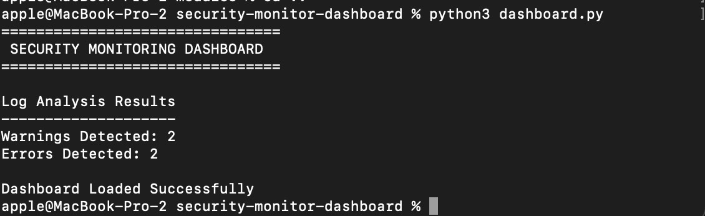

# Security Monitoring Dashboard

A cybersecurity monitoring project built using Python.

## Modules

### Log Analyzer
Detects:
- warnings
- errors
- suspicious activity

### Login Detector
Detects:
- failed logins
- brute-force attempts
- suspicious IP addresses

## Technologies
- Python
- Scapy
- Log Analysis
- Network Monitoring

## Status
Project under development.

## Dashboard Features

- Log Analysis
- Warning Detection
- Error Detection
- Security Event Monitoring

## Example Output

## Login Monitoring

Features:
- Detects failed logins
- Tracks suspicious IP addresses
- Generates brute-force alerts

### Example Alert

## Network Monitoring

Features:
- Captures live packets
- Displays source IP
- Displays destination IP
- Displays protocol information

### Example Output

## Alert Summary Panel

The dashboard classifies security events into:

- HIGH
- MEDIUM
- INFO

### Example Output

