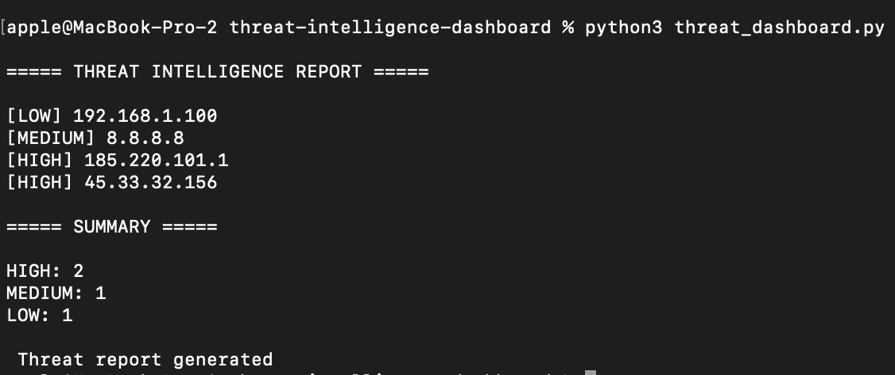
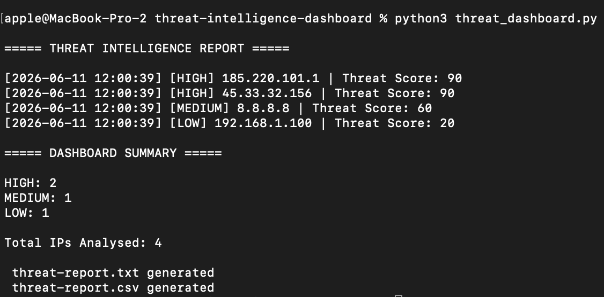
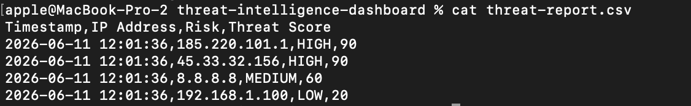
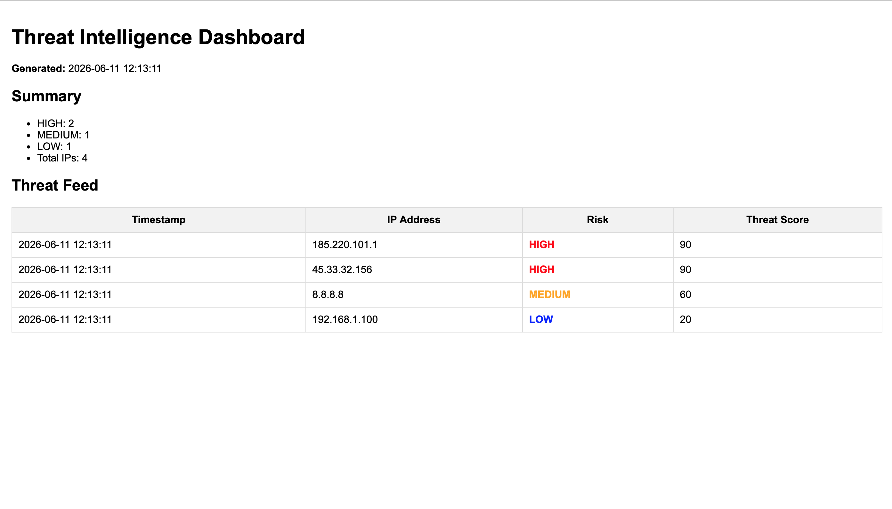
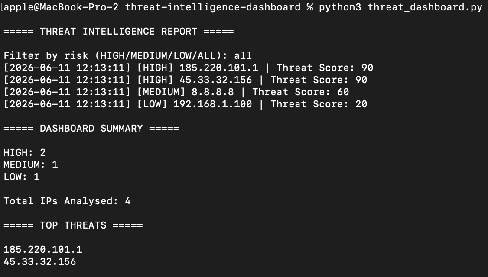

# Threat Intelligence Dashboard

A Python-based cybersecurity project that analyzes IP addresses and classifies them by threat level.

## Features

- Threat classification
- High-risk IP detection
- Medium-risk IP detection
- Summary reporting
- Threat intelligence analysis

## Technologies

- Python
- File Handling

## Screenshot

## Dashboard Statistics

The dashboard provides threat intelligence statistics including:

- High Risk Threats
- Medium Risk Threats
- Low Risk Threats
- Total IPs Analysed

### Example Output

---

## CSV Export

Threat intelligence findings are exported to CSV format.

### Example Output

---

## Threat Scoring

| Risk Level | Score |
|------------|--------|
| HIGH | 90 |
| MEDIUM | 60 |
| LOW | 20 |

---

## JSON Threat Feed Support

The dashboard can parse structured threat feeds in JSON format.

## HTML Dashboard

The project generates a browser-friendly dashboard.

### Example Dashboard

---

## Threat Filtering

Users can filter threats by:

- HIGH
- MEDIUM
- LOW
- ALL

### Example Output

---

## Top Threats

Displays the highest-risk IP addresses.

### Example Output

