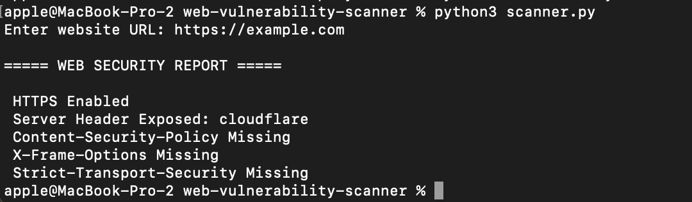
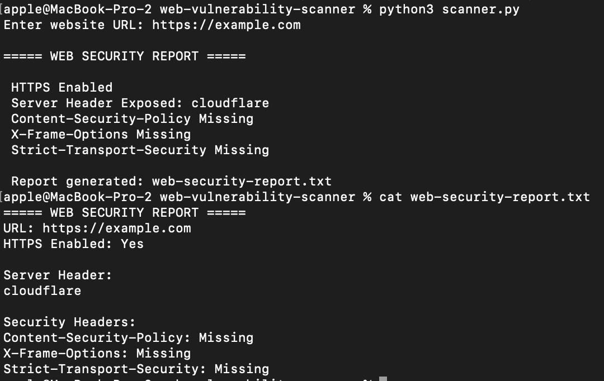
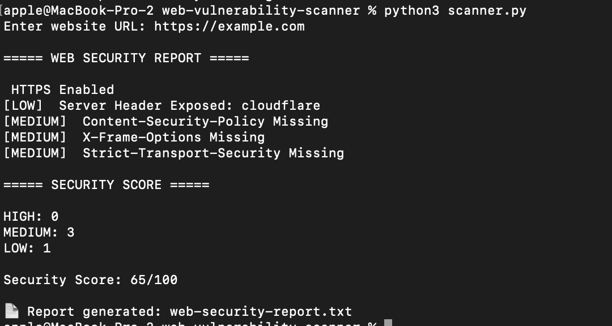
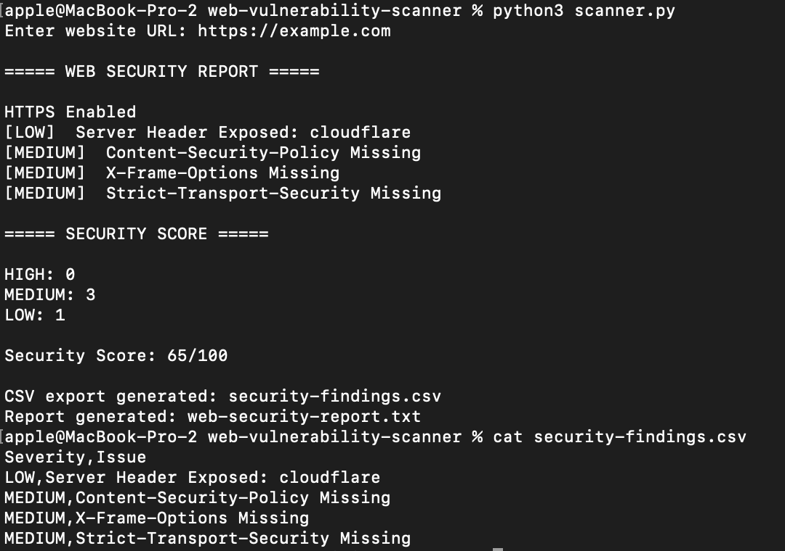
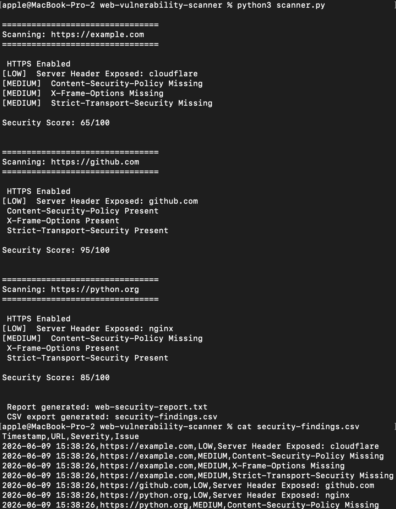
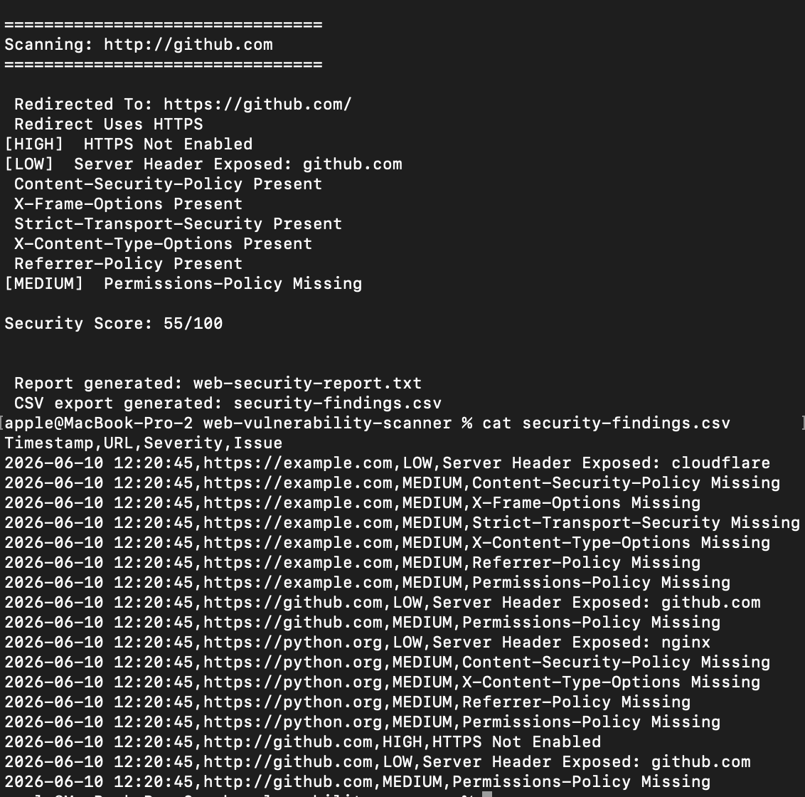
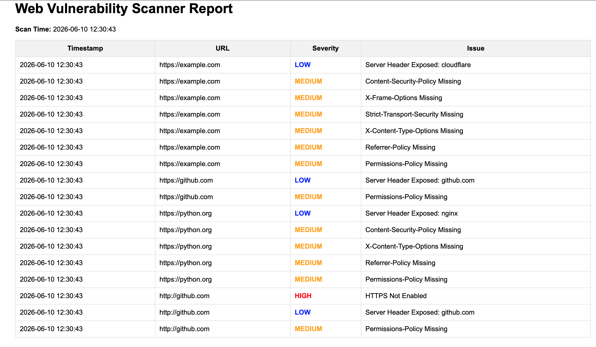

# Web Vulnerability Scanner

A Python-based web security scanner that analyzes website security headers and basic security configurations.

## Features

- HTTPS verification
- Server header detection
- Security header analysis
- Basic vulnerability assessment

## Technologies

- Python
- Requests

## Security Checks

- HTTPS
- Content-Security-Policy
- X-Frame-Options
- Strict-Transport-Security

## Screenshot

### Web Security Scan

## Security Report

The scanner automatically generates a security assessment report.

### Example Report

## Security Scoring

The scanner assigns severity levels and calculates a security score.

### Example Output

## CSV Export

The scanner exports findings into CSV format for security analysis.

### Example Output

## Multiple URL Scanning

The scanner can assess multiple websites from a single input file.

## Timestamped Findings

All findings include timestamps and URLs.

### Example Output

## Redirect Analysis

The scanner checks whether websites redirect users securely to HTTPS.

## Advanced Security Headers

Additional headers checked:

- X-Content-Type-Options
- Referrer-Policy
- Permissions-Policy

### Example Output

## HTML Report Generation

The scanner generates a browser-friendly HTML report.

### Example Report

